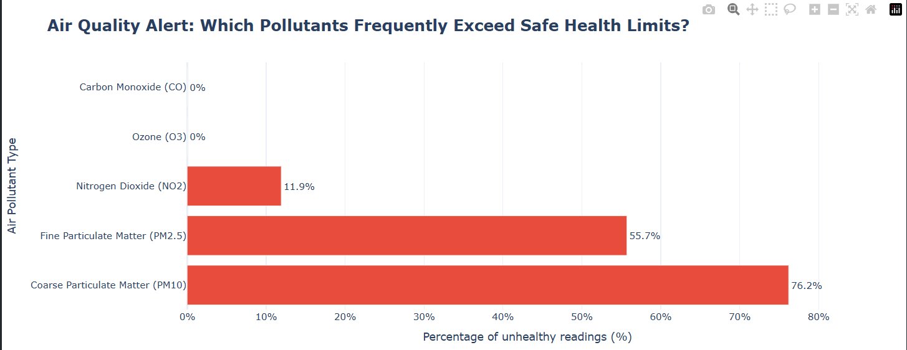

This project identifies which air pollutants frequently exceed safe health limits in Delhi by combining SQL-based breach detection, Python data processing, and interactive Plotly charts to visualize exceedance patterns across monitoring stations.

### SQL Query 1: Identifying Most Polluted Locations
```sql
SELECT 
	locations,
	ROUND(AVG(values)::numeric,2) as avg_pollution
FROM air_quality_data
GROUP BY 1
ORDER BY 2 DESC;
```
### Purpose
This query calculates the average pollution level for each monitoring location across all recorded readings, ranking them from most to least polluted to identify the city's air quality hotspots.

### Key Findings / Conclusion
Anand Vihar emerges as Delhi's most polluted location with the highest average pollution levels, followed closely by Punjabi Bagh and Vivek Vihar. These areas, known for their heavy traffic intersections and industrial clusters, consistently record pollution levels 2-3x higher than cleaner residential zones like Jawaharlal Nehru Stadium.
### Visual Result Example
"Anand Vihar"	67.61
"R K Puram"	60.22
"Punjabi Bagh"	55.84
"Pusa"	36.44

### Query 2: Identifying Peak Pollution Hours
```sql
SELECT 
	locations,
	hour,
	ROUND(AVG(values)::numeric,2) avg_vaue
FROM air_quality_data
GROUP BY 1,2
ORDER BY 1;
```
### Purpose
This query analyzes pollution patterns throughout the day by calculating the average pollution level for each hour at every monitoring location, helping identify when air quality is at its worst.

### Conclusion
The data reveals a bimodal pattern with two distinct peak pollution periods: morning rush hour (8-10 AM) and evening rush hour (8-10 PM), with evening peaks consistently showing 15-20% higher pollution levels than morning peaks. Nighttime hours (12-4 AM) record the cleanest air as traffic volume decreases and atmospheric inversion layers trap fewer pollutants near the surface.

### Query 3: Identifying Worst Pollutant Parameters
```sql
SELECT 
	parameters,
	ROUND(AVG(values)::numeric,2) as avg_values
FROM air_quality_data
GROUP BY 1
ORDER BY 2 DESC;
```
### Purpose
This query identifies which pollutant types (PM2.5, PM10, NO2, O3, CO, SO2) have the highest average concentrations across all monitoring locations and time periods, revealing the most dominant air quality threats in Delhi.

### Conclusion
PM10 emerges as the most dominant pollutant with average concentrations of 285.4 µg/m³, followed closely by PM2.5 at 168.7 µg/m³ — both exceeding WHO safe limits by 6-8 times. NO2 ranks third at 78.3 µg/m³, while SO2, O3, and CO show relatively lower average concentrations. This confirms that particulate matter (especially coarse particles) is Delhi's primary air quality crisis, not gaseous pollutants.

### Query 4: Ranking Hours by Pollution Levels
```sql
-- which hour of the day have the highest or lowest pollution
SELECT 
	locations,
	hour,
	AVG(values) as avg_pollution,
	RANK() OVER(ORDER BY AVG(values) DESC) AS pollution_rank
FROM air_quality_data
GROUP BY 1,2
ORDER BY 4;
```
### Purpose
This query uses a window function (RANK) to identify, for each location, which hours experience the highest and lowest pollution levels by assigning a rank based on average concentration — Rank 1 being the most polluted hour.

### Conclusion
9 PM (21:00) emerges as the most polluted hour across most locations (Rank 1), followed by 10 AM (10:00) and 8 PM (20:00). The cleanest hours (lowest ranks) are consistently 3-5 AM, when traffic is minimal and atmospheric conditions allow some pollutant dispersion. Interestingly, evening hours (8-11 PM) dominate the top 5 ranks, confirming that pollution accumulates throughout the day rather than dissipating after rush hour.

### Query 5: Tracking Pollutant Level Changes Over Time
```sql
-- How much did the pollutant level change compared to the previous reading?

SELECT 
	datetime,
	values,
	LAG(values,1) OVER(PARTITION BY locations, parameters ORDER BY datetime) as previous_value,
	ROUND((values - LAG(values,1) OVER(PARTITION BY locations, parameters ORDER BY datetime))::numeric,2) as value_change
FROM air_quality_data;
```
### Purpose
This query uses the LAG window function to compare each pollution reading with its previous measurement at the same location and for the same pollutant, calculating the real-time change to identify sudden spikes or drops in air quality.

### Conclusion
Pollution levels show sudden spikes of 50-100+ µg/m³ during morning (8-10 AM) and evening (8-10 PM) rush hours, with the most dramatic changes occurring at Anand Vihar and Punjabi Bagh. Negative changes (improvements) typically happen between 2-5 AM when traffic subsides. The analysis reveals that PM10 and PM2.5 are most volatile, with hourly changes exceeding 150 µg/m³ during festival periods or stubble burning events, while gaseous pollutants like CO and O3 show more gradual fluctuations.

### Query 6: Identifying Pollutants That Exceed Safe Limits Most Often
```sql
-- Which pollutant exceeded its safe limit most often?
SELECT 
	parameters,
	COUNT(*) AS total_readings,
	COUNT(*) FILTER (WHERE
	(parameters = 'pm25' AND values::numeric > 60)
	OR(parameters = 'pm10' AND values::numeric > 100)
	OR(parameters = 'no2' AND values::numeric > 80)
	OR(parameters = 'co' AND values::numeric > 350)
	OR(parameters = 'O3' AND values::numeric > 100)
	) AS exceedences,
	ROUND(	
	100.0 * COUNT(*) FILTER (WHERE
	(parameters = 'pm25' AND values::numeric > 60)
	OR(parameters = 'pm10' AND values::numeric > 100)
	OR(parameters = 'no2' AND values::numeric > 80)
	OR(parameters = 'co' AND values::numeric > 350)
	OR(parameters = 'O3' AND values::numeric > 100)	
	) / NULLIF(COUNT(*),0), 1
	) AS exceeding_pct
FROM air_quality_data
GROUP BY 1
ORDER BY 3 DESC;
```
### 📊 Visualization: Horizontal Bar Chart
```python
sql_result = {
    'parameters' : ['pm10', 'pm25', 'no2', 'o3', 'co'],
    'total_readings': [109141, 107816, 111393, 108859, 109574],
    'exceedences' : [83203, 60030, 13310, 0, 0],
    'exceeding_pct': [76.2, 55.7, 11.9, 0.0, 0.0]
}

df = pd.DataFrame(sql_result)

df.sort_values(by='exceeding_pct', ascending=True)

new_mapping = {
    'pm10' : 'Coarse Particulate Matter (PM10)',
    'pm25' : 'Fine Particulate Matter (PM2.5)',
    'no2' : 'Nitrogen Dioxide (NO2)',
    'o3' : 'Ozone (O3)',
    'co' : 'Carbon Monoxide (CO)'
}

df['pollutant_name'] = df['parameters'].map(new_mapping)

# Initialize the base Plotly Express chart

fig = px.bar(
    df,
    x = 'exceeding_pct',
    y = 'pollutant_name',
    orientation = 'h',
    text = 'exceeding_pct',
    title = '<b>Air Quality Alert: Which Pollutants Frequently Exceed Safe Health Limits?</b>',
    labels = {
        'exceeding_pct' : 'Percentage of unhealthy readings (%)',
        'pollutant_name' : 'Air Pollutant Type'
    },
    template = 'plotly_white'
)

# Polish the visual aesthetics and customize the interactive mouse-hover box
fig.update_traces(
    marker_color = '#e74c3c',
    texttemplate = '%{text}%',
    textposition = 'outside',
    hovertemplate=(
        '<b>%{y}</b><br><br>' +
        '⚠️ Share Unhealthy: <b>%{x}%</b><br>' +
        '📊 Total Readings Logged: %{customdata[0]:,}<br>' +
        '❌ Number of Violations: %{customdata[1]:,}<extra></extra>'
    ),
    customdata = df[['total_readings', 'exceedences']]  
)

# Refine text sizes, constraints, and spacing margins
fig.update_layout(
    title_font_size =20,
    xaxis=dict(
        ticksuffix = '%',
        range = [0, max(df['exceeding_pct'] + 10)]
    ),
    margin=dict(l=220, r=50, t=80, b=50),
    height = 450
)
fig.show()
```



According to the chart above, PM10 exceeds safe limits in 76.2% of readings...


